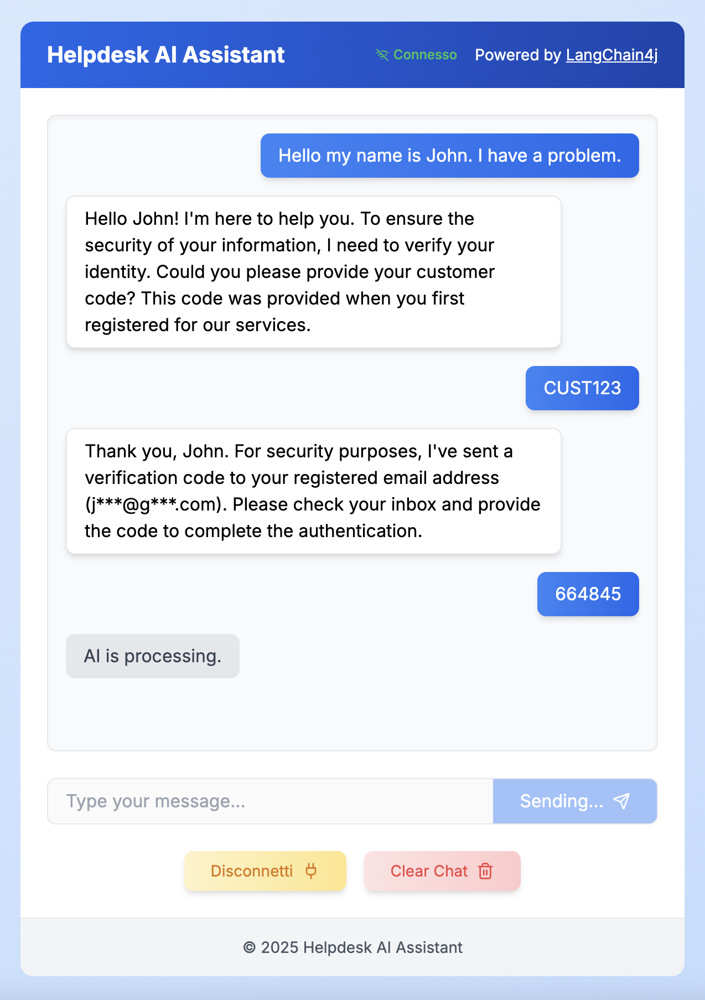
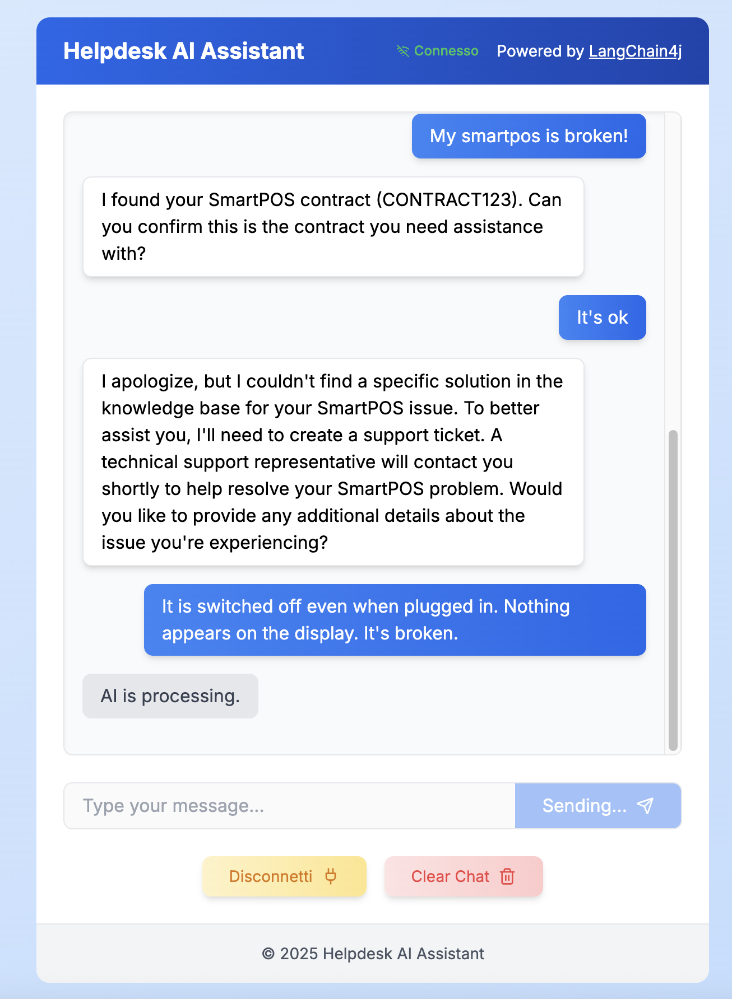
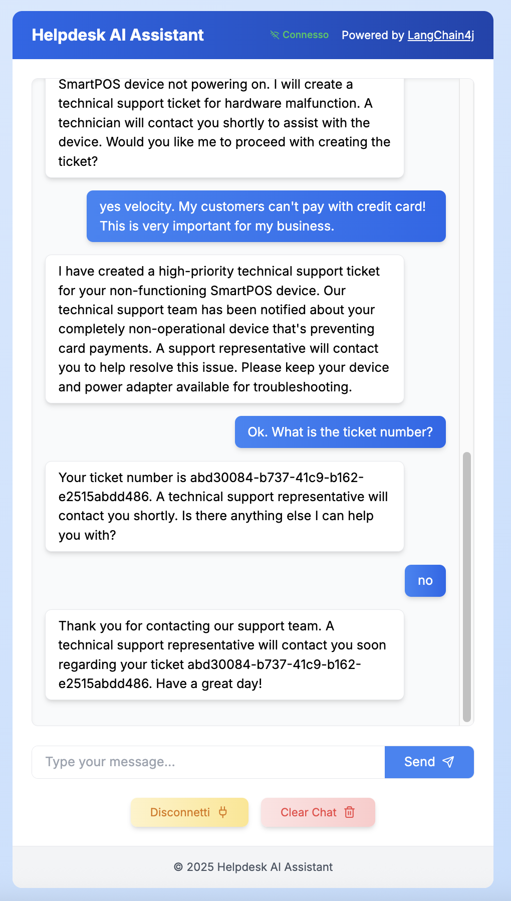

# Assistant Helpdesk

A Spring Boot application that implements a multi-agent RAG (Retrieval Augmented Generation) helpdesk assistant, capable of handling customer support requests through multiple channels (chat, email, WhatsApp).

## Architecture Overview

This project demonstrates a sophisticated AI-powered helpdesk system that uses Claude 3 LLMs (via Anthropic) and multiple specialized agents to handle customer support tasks:

- **Stateful Supervisor Agent** - Manages the conversation flow and delegates to specialized agents
- **Authentication Agent** - Verifies customer identity
- **Contract Verification Agent** - Checks customer contract details
- **Issue Classification Agent** - Categorizes customer issues
- **Knowledge Base Agent** - Retrieves relevant information from documents
- **Ticket Creation Agent** - Creates support tickets in the system

The application is built using:
- Spring Boot 3.4.3
- LangChain4j (Java AI framework)
- Anthropic Claude 3 Sonnet
- WebSockets for real-time chat
- JPA/Hibernate with H2 in-memory database
- Apache Camel for message routing

## Requirements

- JDK 21
- Maven 3.8+
- Docker (for running GreenMail email server)
- Anthropic API key
- (Optional) Twilio account for WhatsApp integration

## Environment Variables

The following environment variables need to be set:

```
CLAUDE_API_KEY=your_anthropic_api_key
MAIL_IMAP_USERNAME=testuser
MAIL_IMAP_PASSWORD=testpassword
MAIL_SMTP_USERNAME=testuser
MAIL_SMTP_PASSWORD=testpassword
TWILIO_ACCOUNT_SID=your_twilio_sid (optional)
TWILIO_AUTH_TOKEN=your_twilio_token (optional)
```

## Building and Running

1. Start the GreenMail server for email testing:
   ```
   docker-compose up -d
   ```

2. Build the application:
   ```
   mvn clean install
   ```

3. Run the application:
   ```
   mvn spring-boot:run
   ```

4. Access the chat interface at: http://localhost:8080

## Screenshots
The following screenshots show the chat interface and interactions with the helpdesk assistant:





## Features

- Multi-channel support (chat, email, WhatsApp)
- Vectorized knowledge base for retrieving helpful information
- Customer authentication with OTP verification
- Contract validation
- Automatic issue classification
- Ticket creation
- Conversation memory with persistence
- Specialized AI agents for different tasks

## PDFs Included

The application includes two PDF guides that are automatically indexed at startup:
- SmartPOS guide
- MobilePOS usage guide

## Acknowledgments

This project uses [LangChain4j](https://github.com/langchain4j/langchain4j) for Java AI integration.